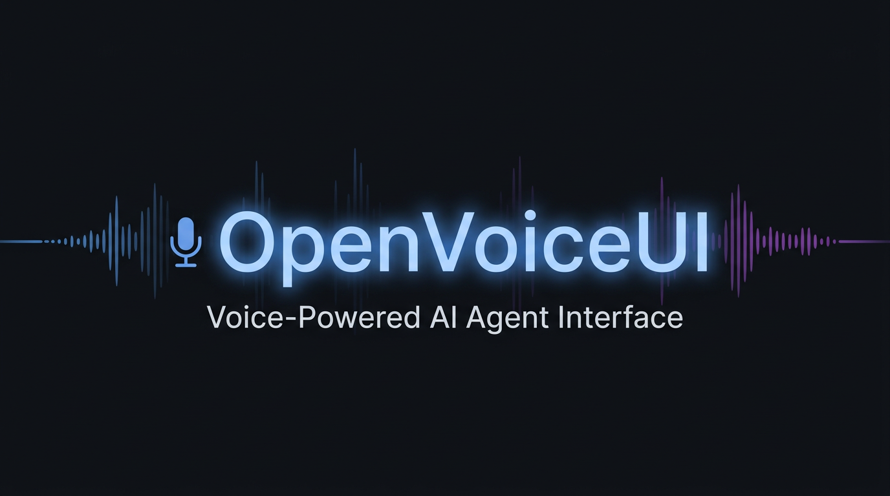

<p align="center">

</p>

# OpenVoiceUI

A plug-and-play browser-based voice agent platform. Connect any LLM, any TTS provider, and any AI framework — with a built-in music player, AI music generation, and a live web canvas display system.

> **Hosting notice:** OpenVoiceUI is designed to run on a dedicated VPS (see [Hetzner setup](#hosting-multiple-users-hetzner-vps) below). Running it on a local machine is possible but not recommended — microphone access, SSL, and persistent uptime all work significantly better on a hosted server. For the best experience, deploy to a VPS before using it seriously.

---

## What It Is

OpenVoiceUI is a modular voice UI shell. You bring the intelligence (LLM + TTS), it handles everything else:

- **Voice I/O** — browser-based STT with push-to-talk, wake words, or continuous mode
- **Animated Face** — responsive eye-face avatar with 7 mood states driven by emotion detection
- **Web Canvas** — fullscreen iframe display system for AI-generated HTML pages, dashboards, and reports
- **Music Player** — background music with crossfade, AI ducking, and AI trigger commands
- **Music Generation** — AI-generated track support via Suno or fal.ai integrations
- **Soundboard** — configurable sound effects with text-trigger detection
- **Agent Profiles** — switch personas/providers without restart via JSON config
- **Live Instruction Editor** — hot-reload system prompt from the admin panel
- **Admin Dashboard** — session control, playlist editor, face picker, theme editor

---

## Open Framework Philosophy

OpenVoiceUI is built as an **open voice UI shell** — it doesn't lock you into any specific LLM, TTS engine, STT provider, or AI framework. Every layer is a pluggable slot. Drop in a gateway plugin, a TTS provider, or a custom adapter and it just works. The built-in providers are defaults, not requirements.

### LLM / Gateway Providers
Connect to any LLM via a gateway plugin — OpenClaw is built-in, others are drop-in:

| Provider | Status |
|----------|--------|
| Any OpenClaw-compatible gateway | ✓ Built-in |
| Z.AI (GLM models) | ✓ Built-in |
| OpenAI-compatible APIs | ✓ Via adapter |
| Ollama (local) | ✓ Via adapter |
| Hume EVI | ✓ Built-in adapter |
| LangChain, AutoGen, custom agent framework | ✓ Via gateway plugin |
| **Any LLM or framework you build a plugin for** | ✓ Drop a folder in `plugins/` |

### TTS Providers
| Provider | Type | Cost |
|----------|------|------|
| **Supertonic** | Local ONNX | Free |
| **Groq Orpheus** | Cloud, fast | ~$0.05/min |
| **Qwen3-TTS** | Cloud, expressive | ~$0.003/min |
| **Hume EVI** | Cloud, emotion-aware | ~$0.032/min |
| **Any TTS engine you implement** | Local or cloud | Your choice |

### STT
- Web Speech API (browser-native, no API key needed)
- Whisper (local)
- Hume EVI (full-duplex)
- Any STT provider via a custom adapter

---

## Features

### Voice Modes
- **Continuous** — always listening, silence timeout triggers send
- **Push-to-Talk** — hold button or configurable hotkey (keyboard/mouse)
- **Listen** — passive monitoring mode
- **Agent-to-Agent** — A2A communication panel

### Canvas System
- AI can open and display any HTML page in a fullscreen overlay
- Manifest-based page discovery with search, categories, and starred pages
- Triggered via `[CANVAS:page-id]` tags in AI responses
- Real-time SSE updates from server

### Music Player
- Background playlist with crossfade (1.5s smooth transitions)
- Auto-ducking during TTS (volume drops, restores after)
- AI voice commands: play, stop, skip, volume up/down
- Generated tracks (AI-composed) + custom playlists
- Track history (back button, 20-track buffer)

### Profile System
Define agents in JSON — each profile configures:
- LLM provider, model, parameters
- TTS voice, speed, parallel sentence mode
- STT silence timeout, PTT mode, wake words
- UI theme, face mood, enabled features
- Session key strategy

---

## Project Structure

```
├── server.py                   Entry point
├── app.py                      Flask app factory
├── routes/
│   ├── conversation.py         Voice + parallel TTS streaming
│   ├── canvas.py               Canvas display system
│   ├── instructions.py         Live system prompt editor
│   ├── music.py                Music control
│   ├── profiles.py             Agent profile management
│   ├── admin.py                Admin + server stats
│   └── ...
├── services/
│   ├── auth.py                 Clerk JWT authentication middleware
│   ├── db_pool.py              SQLite WAL connection pool
│   ├── health.py               Liveness + readiness health probes
│   ├── paths.py                Canonical path constants (all dirs)
│   ├── gateway_manager.py      Gateway registry + plugin loader + router
│   ├── gateways/
│   │   ├── base.py             GatewayBase abstract class
│   │   └── openclaw.py         OpenClaw gateway implementation
│   └── tts.py                  TTS service wrapper
├── tts_providers/              TTS provider implementations
├── providers/                  LLM/STT provider implementations
├── plugins/                    Gateway plugins (gitignored, drop-in)
│   ├── README.md               Plugin authoring guide
│   └── example-gateway/        Reference implementation
├── profiles/                   Agent profile JSON files
│   └── default.json            Base agent (edit to personalize)
├── prompts/
│   └── voice-system-prompt.md  Hot-reload system prompt
├── config/
│   ├── default.yaml            Server configuration
│   └── speech_normalization.yaml
├── src/
│   ├── app.js                  Frontend core (~5900 lines)
│   ├── adapters/               Adapter implementations
│   │   ├── ClawdBotAdapter.js
│   │   ├── hume-evi.js
│   │   ├── elevenlabs-classic.js
│   │   └── _template.js        Build your own adapter
│   ├── core/                   EventBus, VoiceSession, EmotionEngine
│   ├── features/               MusicPlayer, Soundboard
│   ├── shell/                  Orchestrator, bridges, profile discovery
│   ├── ui/                     AppShell, SettingsPanel, ThemeManager
│   └── providers/              WebSpeechSTT, TTSPlayer
├── sounds/                     Soundboard audio files
└── runtime/                    Runtime data (gitignored, docker-mounted)
    ├── uploads/                User-uploaded files
    ├── canvas-pages/           Canvas HTML pages
    ├── known_faces/            Face recognition photos
    ├── music/                  Music playlist folder
    ├── generated_music/        AI-generated tracks
    ├── transcripts/            Listen-mode transcriptions
    └── canvas-manifest.json    Canvas page registry
```

---

## Prerequisites

- **OpenClaw gateway** — [openclaw.ai](https://openclaw.ai)
- **Groq API key** for TTS — [console.groq.com](https://console.groq.com) (free tier available)
- Optional: Suno API key (music generation), Clerk (auth for multi-user deployments)

---

## Deployment (Recommended: VPS)

The recommended way to run OpenVoiceUI is on a dedicated VPS — microphone access, SSL, and always-on uptime all work significantly better hosted than on a local machine.

A setup script handles nginx, Let's Encrypt SSL, and systemd automatically:

```bash
git clone https://github.com/MCERQUA/OpenVoiceUI-public
cd OpenVoiceUI-public
cp .env.example .env
# Edit .env — set CLAWDBOT_AUTH_TOKEN and GROQ_API_KEY at minimum
# Edit setup-sudo.sh — set DOMAIN, PORT, EMAIL, INSTALL_DIR at the top
sudo bash setup-sudo.sh
```

The script is idempotent — safe to re-run. Skips SSL if cert already exists.

```bash
sudo systemctl status openvoiceui
sudo journalctl -u openvoiceui -f
```

---

## Local Install (Docker)

If you want to run OpenVoiceUI on a local machine, Docker is the easiest path. Note that browser microphone access requires HTTPS — on localhost Chrome/Edge will still allow it, but other devices on your network won't work without a cert.

```bash
git clone https://github.com/MCERQUA/OpenVoiceUI-public
cd OpenVoiceUI-public
cp .env.example .env
# Edit .env — set CLAWDBOT_AUTH_TOKEN and GROQ_API_KEY
docker compose up --build
```

Open `http://localhost:5001` in your browser.

### Minimum `.env`

```bash
PORT=5001
CLAWDBOT_GATEWAY_URL=ws://host.docker.internal:18791
CLAWDBOT_AUTH_TOKEN=your-openclaw-gateway-token
GROQ_API_KEY=your-groq-key
```

> **Note:** `host.docker.internal` lets the container reach your local OpenClaw gateway. On Linux add `extra_hosts: ["host.docker.internal:host-gateway"]` to `docker-compose.yml` if needed.

---

## Authentication

Auth is **opt-in**. By default, OpenVoiceUI runs with no authentication — all endpoints are accessible. This is the right setting for self-hosted single-user deployments.

To **enable Clerk JWT auth** (for multi-user or public-facing deployments):
1. Create a Clerk app at [clerk.com](https://clerk.com)
2. Add `CLERK_PUBLISHABLE_KEY=pk_live_...` to `.env`
3. Set `CANVAS_REQUIRE_AUTH=true` in `.env`
4. Set `ALLOWED_USER_IDS=user_yourclerkid` — find your user ID in server logs after first login

---

## OpenClaw Integration

OpenVoiceUI connects to an [OpenClaw](https://openclaw.ai) gateway via persistent WebSocket. OpenClaw handles LLM routing, tool use, and agent sessions.

**OpenClaw ≥ 2026.2.24**: Requires Ed25519 device identity signing. OpenVoiceUI handles this automatically — a `.device-identity.json` file is generated on first run (never committed to git). The gateway auto-approves local loopback clients on first connect.

**Without a configured gateway**: The frontend will load but `/api/conversation` calls will fail. OpenClaw is the default — or drop in any gateway plugin as a replacement.

---

## Configuration

### Environment Variables

```bash
# Gateway / LLM
CLAWDBOT_GATEWAY_URL=ws://127.0.0.1:18791
CLAWDBOT_AUTH_TOKEN=your-token

# TTS — choose one or more
GROQ_API_KEY=your-groq-key          # Groq Orpheus TTS
FAL_KEY=your-fal-key                # Qwen3-TTS via fal.ai
SUPERTONIC_MODEL_PATH=/path/to/onnx # Local Supertonic TTS

# Hume EVI (optional full-duplex voice mode)
HUME_API_KEY=your-hume-key
HUME_CONFIG_ID=your-config-id

# Auth (optional — uses Clerk)
CLERK_PUBLISHABLE_KEY=pk_live_...

# Server
PORT=5001
```

### Personalizing Your Agent

Edit `profiles/default.json` to configure your agent:

```json
{
  "name": "My Assistant",
  "system_prompt": "You are a helpful voice assistant...",
  "llm": { "provider": "gateway", "model": "glm-4.7" },
  "voice": { "tts_provider": "groq", "voice_id": "tara" },
  "features": { "canvas": true, "music": true, "tools": true }
}
```

Edit `prompts/voice-system-prompt.md` to change the system prompt — changes are hot-reloaded with no restart.

---

## API Reference

```bash
# Health
GET  /health/live
GET  /health/ready

# Voice (streaming NDJSON)
POST /api/conversation?stream=1
     {"message": "Hello", "tts_provider": "groq", "voice": "tara"}

# Profiles
GET  /api/profiles
POST /api/profiles/activate  {"profile_id": "default"}

# Canvas
GET  /api/canvas/manifest

# Session
POST /api/session/reset  {"type": "hard"}

# TTS
GET  /api/tts/providers
POST /api/tts/generate  {"text": "Hello", "provider": "groq", "voice": "tara"}
```

---

## Building an Adapter

To connect a new LLM or voice framework, use `src/adapters/_template.js` as a starting point. Adapters implement a simple interface:

```js
export class MyAdapter {
  async init(bridge, config) { ... }
  async start() { ... }
  async stop() { ... }
  async destroy() { ... }
}
```

Register it in `src/shell/adapter-registry.js` and reference it in your profile JSON.

---

## Gateway Plugins

The backend uses a plugin system for LLM gateways. Drop a folder into `plugins/`, restart — it's live.

```
plugins/
  my-gateway/
    plugin.json   ← manifest (id, provides, requires_env)
    gateway.py    ← class Gateway(GatewayBase)
```

**plugin.json:**
```json
{
  "id": "my-gateway",
  "provides": "gateway",
  "gateway_class": "Gateway",
  "requires_env": ["MY_API_KEY"]
}
```

**gateway.py** subclasses `services.gateways.base.GatewayBase` and implements `stream_to_queue()`.

To route a profile to your gateway, add `gateway_id` to its `adapter_config`:
```json
"adapter_config": { "gateway_id": "my-gateway", "sessionKey": "my-1" }
```

Gateways can also call each other for inter-agent delegation:
```python
from services.gateway_manager import gateway_manager
result = gateway_manager.ask("openclaw", "Summarise this: " + text, session_key)
```

Full guide: [`plugins/README.md`](plugins/README.md)

---

## Hosting Multiple Users (Hetzner VPS)

OpenVoiceUI is designed so you can host a single VPS and serve multiple clients, each with their own voice agent instance.

**Recommended workflow:**

1. **Set up your base account** — install OpenVoiceUI on a Hetzner VPS under a base Linux user. Configure all API keys in `.env`. Verify everything works.

2. **For each new client**, create a new Linux user on the same VPS:
   ```bash
   adduser clientname
   cp -r /home/base/OpenVoiceUI-public /home/clientname/OpenVoiceUI-public
   chown -R clientname:clientname /home/clientname/OpenVoiceUI-public
   ```

3. **Edit their `.env`** with their API keys and a unique port:
   ```bash
   PORT=15004          # different port per user
   CLAWDBOT_AUTH_TOKEN=their-openclaw-token
   GROQ_API_KEY=their-groq-key
   ```

4. **Run `setup-sudo.sh`** for their domain — creates systemd service, nginx vhost, and SSL cert automatically.

5. **Each client** gets their own domain, their own agent session, and their own canvas/music library.

**Quick server requirements:**
- Ubuntu 22.04+
- Nginx + Certbot (Let's Encrypt)
- Python 3.10+, `venv` per user

---

## Tech Stack

| Layer | Technology |
|-------|------------|
| Backend | Python / Flask (blueprint architecture) |
| Frontend | Vanilla JS ES modules (no framework) |
| STT | Web Speech API / Whisper / Hume |
| TTS | Supertonic / Groq Orpheus / Qwen3 / Hume EVI |
| LLM | Any via gateway adapter |
| Canvas | Fullscreen iframe + SSE manifest system |
| Music Gen | Suno API / fal.ai |
| Auth | Clerk (optional) |

---

## License

MIT
